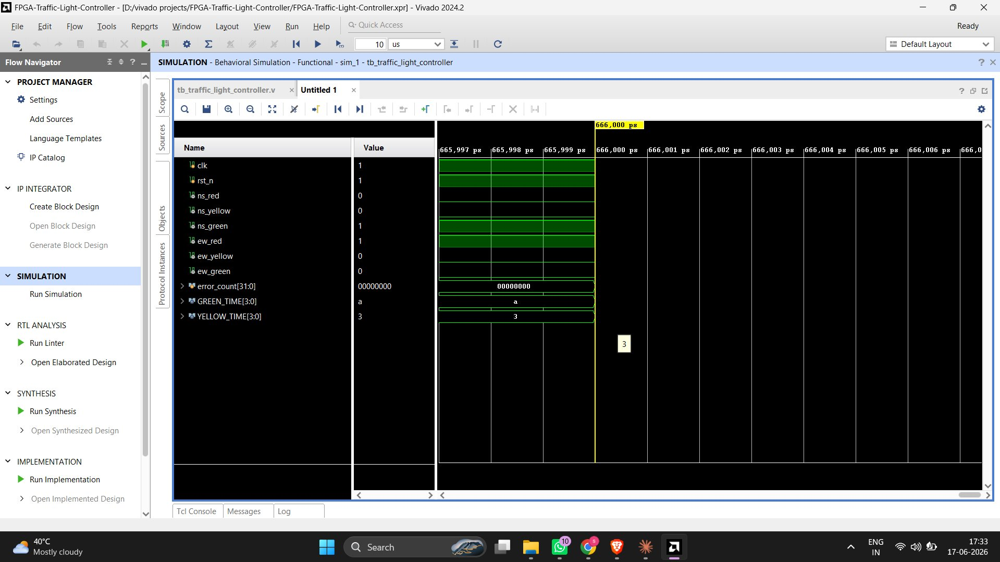
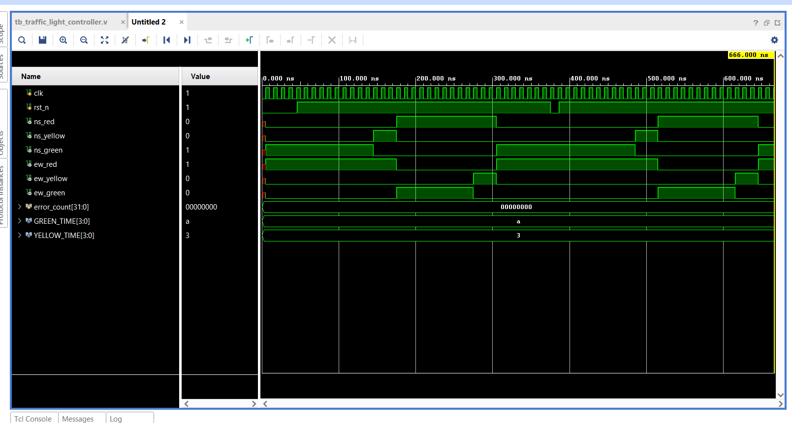
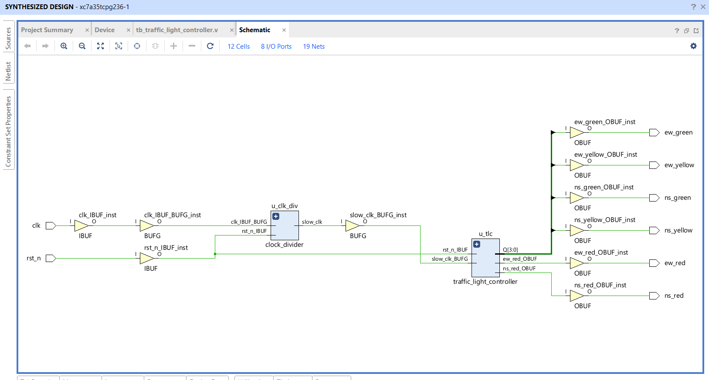
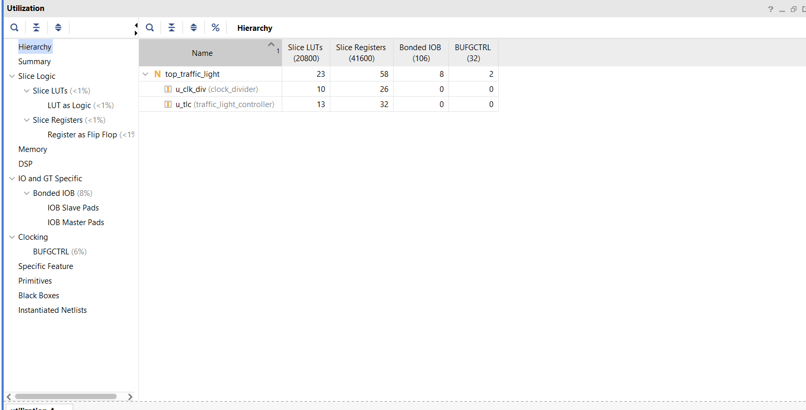
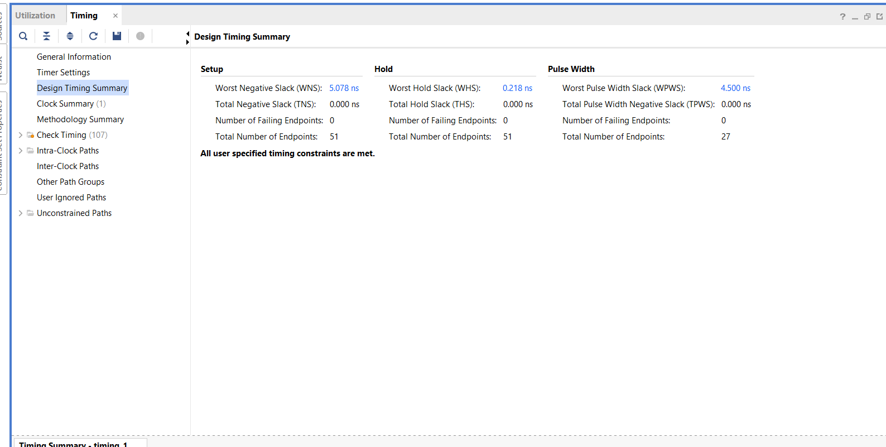
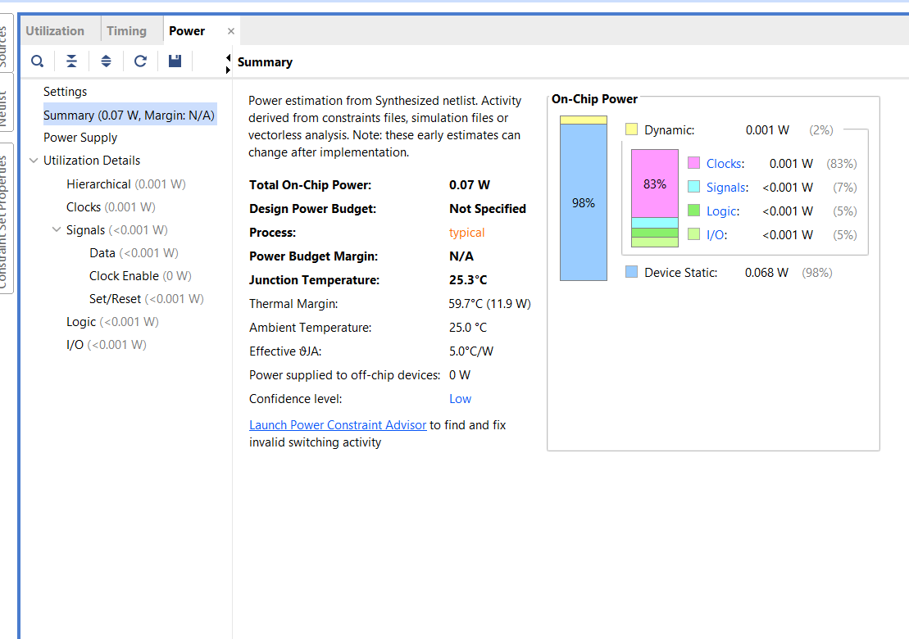
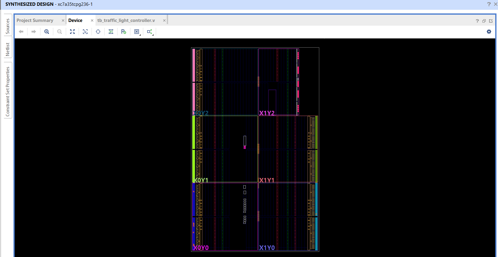
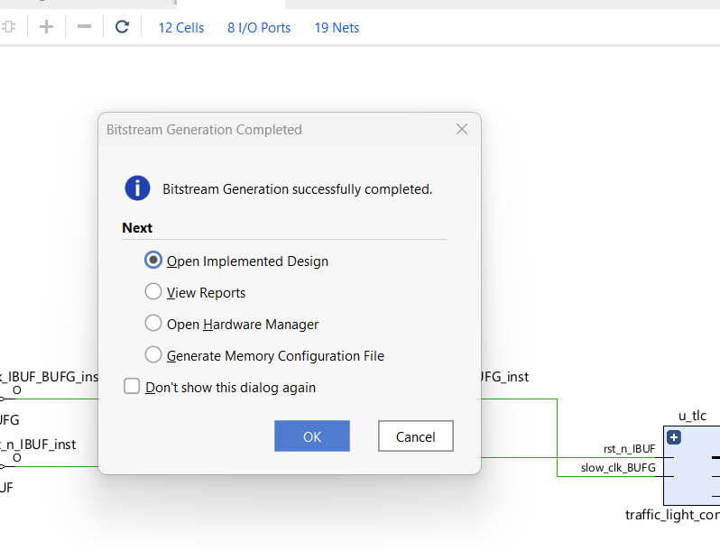

# 🚦 FPGA-Based Traffic Light Controller

[](https://en.wikipedia.org/wiki/Verilog)
[](https://edaplayground.com)
[](https://digilent.com/basys3)
[]()
[](LICENSE)

> A complete industry-oriented VLSI project implementing a Moore Finite State Machine (FSM)-based traffic light controller in Verilog. Designed for FPGA deployment (Basys3) with full simulation and testbench support.

---

## 📋 Table of Contents
- [Overview](#overview)
- [Problem Statement](#problem-statement)
- [VLSI Concepts Used](#vlsi-concepts-used)
- [FSM Design](#fsm-design)
- [Architecture](#architecture)
- [Folder Structure](#folder-structure)
- [Tools Used](#tools-used)
- [How to Simulate](#how-to-simulate)
- [FPGA Implementation](#fpga-implementation)
- [Waveform Results](#waveform-results)
- [Screenshots Checklist](#screenshots-checklist)
- [Future Improvements](#future-improvements)
- [Learning Outcomes](#learning-outcomes)

---

## 🔍 Overview

This project implements a **4-state Moore FSM** that controls traffic signals for a two-direction intersection:

- **North-South (NS):** Red / Yellow / Green
- **East-West (EW):** Red / Yellow / Green

The controller cycles through states in a fixed timer-driven sequence, ensuring only one direction has green at a time, with a yellow warning before each transition.

---

## ❓ Problem Statement

Traffic intersections must safely and efficiently alternate the right-of-way between crossing roads. A poorly timed or incorrect signal causes accidents and congestion. Digital FSM-based controllers solve this by:

- Providing **deterministic, glitch-free** state transitions
- Ensuring **mutual exclusion** — NS and EW never have green simultaneously
- Enabling **parameterizable timing** for different intersection types
- Being **synthesizable to FPGA/ASIC** hardware

---

## 🧠 VLSI Concepts Used

| Concept | Role in This Project |
|---|---|
| **FPGA** | Target hardware platform (Basys3 / Artix-7) |
| **Verilog RTL** | Hardware description language used |
| **Finite State Machine** | Core control logic (4 states) |
| **Clock Divider** | Scales 50 MHz → 1 Hz for visible LED timing |
| **Sequential Logic** | State registers, timer counter |
| **Combinational Logic** | Next-state logic, output decode |
| **Synchronous Reset** | Puts FSM in known state on power-up |
| **Testbench** | Automated functional verification |
| **XDC Constraints** | Maps ports to physical FPGA pins |
| **Moore FSM** | Outputs depend only on state (glitch-free) |

---

## 🔄 FSM Design

### State Diagram

```
    ┌────────────── timer_done ──────────────┐
    │                                         │
    ▼                                         │
  [S0]──timer_done──►[S1]──timer_done──►[S2]──timer_done──►[S3]
NS Green             NS Yellow            EW Green            EW Yellow
EW Red               EW Red               NS Red              NS Red
```

### State Table

| State | NS Red | NS Yellow | NS Green | EW Red | EW Yellow | EW Green | Duration |
|-------|--------|-----------|----------|--------|-----------|----------|----------|
| S0    | 0 | 0 | **1** | **1** | 0 | 0 | GREEN_TIME  |
| S1    | 0 | **1** | 0 | **1** | 0 | 0 | YELLOW_TIME |
| S2    | **1** | 0 | 0 | 0 | 0 | **1** | GREEN_TIME  |
| S3    | **1** | 0 | 0 | 0 | **1** | 0 | YELLOW_TIME |

### Default Parameters (configurable)
```verilog
parameter GREEN_TIME  = 4'd10;  // Simulation: 10 ticks | FPGA: 10 seconds
parameter YELLOW_TIME = 4'd3;   // Simulation: 3 ticks  | FPGA: 3 seconds
```

---

## 🏗️ Architecture

```
clk (50 MHz) ──►[Clock Divider]──► slow_clk (1 Hz)
                                        │
                                   ┌────▼─────────────┐
rst_n ─────────────────────────►   │   FSM Controller  │
                                   │                   │
                                   │ ┌─State Register─┐│
                                   │ │   S0/S1/S2/S3  ││
                                   │ └───────┬────────┘│
                                   │ ┌─Timer Counter──┐│
                                   │ │  0→GREEN_TIME  ││
                                   │ └───────┬────────┘│
                                   │ ┌─Output Logic───┐│
                                   │ │ Moore decode   ││
                                   │ └───────┬────────┘│
                                   └─────────┼──────────┘
                                             │
              ns_red  ns_yellow  ns_green   ew_red  ew_yellow  ew_green
                │         │          │        │        │          │
               LED0      LED1       LED2    LED3     LED4       LED5
```

---

## 📁 Folder Structure

```
FPGA-Traffic-Light-Controller/
│
├── rtl/                          # Synthesizable RTL source files
│   ├── traffic_light_controller.v   # Main FSM module
│   ├── clock_divider.v              # 50 MHz → 1 Hz divider
│   └── top_traffic_light.v          # Top-level FPGA wrapper
│
├── tb/                           # Testbench files (non-synthesizable)
│   └── tb_traffic_light_controller.v
│
├── constraints/                  # FPGA pin constraint files
│   └── traffic_light_basys3.xdc     # Basys3 LED/clock pin mapping
│
├── simulation/                   # Simulation scripts and guides
│   ├── run_sim.sh                   # Icarus Verilog run script
│   └── edaplayground_guide.md       # EDA Playground step-by-step
│
├── waveforms/                    # VCD waveform files (generated by sim)
│   └── traffic_light_sim.vcd
│
├── images/                       # Screenshots for GitHub display
│   ├── fsm_diagram.png
│   ├── waveform_screenshot.png
│   └── rtl_schematic.png
│
├── reports/                      # Project documentation
│   └── project_report.md
│
├── docs/                         # Additional documentation
│   ├── interview_prep.md            # 10 interview Q&A
│   ├── github_guide.md              # Step-by-step GitHub upload guide
│   └── vivado_2024_2_guide.md       # Complete Vivado 2024.2 walkthrough
│
├── README.md                     # This file
└── .gitignore
```

---

## 🛠️ Tools Used

| Tool | Purpose | Cost |
|------|---------|------|
| **Icarus Verilog** | Compilation & simulation | Free |
| **GTKWave** | Waveform viewing | Free |
| **EDA Playground** | Browser-based simulation | Free |
| **ModelSim** | Industry simulation | Free (student) |
| **Xilinx Vivado** | Synthesis & FPGA implementation | Free (WebPack) |
| **Basys3 FPGA** | Hardware deployment | Optional |

---

## ▶️ How to Simulate

### Option A: EDA Playground (No Installation)
1. Go to [edaplayground.com](https://edaplayground.com)
2. Left panel: paste `rtl/traffic_light_controller.v`
3. Right panel: paste `tb/tb_traffic_light_controller.v`
4. Select: **Icarus Verilog**, check **Open EPWave**
5. Click ▶ **Run**

See: `simulation/edaplayground_guide.md`

### Option B: Icarus Verilog (Linux / WSL / macOS)
```bash
# Install
sudo apt install iverilog gtkwave

# Clone this repo
git clone https://github.com/YOUR_USERNAME/FPGA-Traffic-Light-Controller
cd FPGA-Traffic-Light-Controller

# Run simulation
chmod +x simulation/run_sim.sh
./simulation/run_sim.sh
```

### Option C: Vivado Simulator
1. Create new project → Simulation only
2. Add `rtl/traffic_light_controller.v` as design source
3. Add `tb/tb_traffic_light_controller.v` as simulation source
4. Set testbench as top module
5. Run Simulation → Run All (Ctrl+Shift+R)

### Expected Output
```
============================================================
 FPGA Traffic Light Controller — Testbench Simulation
============================================================
PASS [S0] ...  | NS=001 EW=100 ✓
PASS [S1] ...  | NS=010 EW=100 ✓
PASS [S2] ...  | NS=100 EW=001 ✓
PASS [S3] ...  | NS=100 EW=010 ✓
...
 ALL TESTS PASSED ✓ — No errors detected.
============================================================
```

**Actual Vivado 2024.2 Tcl Console output:**



**Actual waveform (0–666 ns, full FSM cycle):**



---

## 🔧 FPGA Implementation (Basys3)

1. Open Xilinx Vivado → New RTL Project
2. Add Sources: all files in `rtl/`
3. Add Constraints: `constraints/traffic_light_basys3.xdc`
4. Set `top_traffic_light` as top module
5. Run Synthesis → Run Implementation
6. Generate Bitstream
7. Program Device via Hardware Manager
8. Observe LEDs 0-5 cycling through traffic states

**LED Mapping:**
- LED0 = NS Red | LED1 = NS Yellow | LED2 = NS Green
- LED3 = EW Red | LED4 = EW Yellow | LED5 = EW Green

### Synthesis & Implementation Results (Vivado 2024.2, Basys3 — xc7a35tcpg236-1)

**Synthesized Schematic** — clock divider + FSM + 6 LED output buffers:



**Resource Utilization** — only 23 LUTs, 58 registers (tiny footprint):



**Timing Summary** — WNS = 5.078 ns, all constraints met:



**Power Summary** — 0.07 W total on-chip power:



**Device View** — design mapped onto the Artix-7 part:



**Bitstream Generation** — successfully completed, ready to program:



---

## 📊 Waveform Results

Expected waveform for GREEN_TIME=10, YELLOW_TIME=3 ticks:

```
ns_green  ██████████░░░░░░░░░░░░░░░░░░░░░░░░░░░░░░████
ns_yellow ░░░░░░░░░░███░░░░░░░░░░░░░░░░░░░░░░░░░░░░░░░
ns_red    ░░░░░░░░░░░░░███████████████░░░░░░░░░░░░░░░░
ew_red    ████████████████░░░░░░░░░░░░░░░░░░░░░░░░████
ew_green  ░░░░░░░░░░░░░███████████░░░░░░░░░░░░░░░░░░░░
ew_yellow ░░░░░░░░░░░░░░░░░░░░░░░░████░░░░░░░░░░░░░░░░
          |<──S0──>|<S1>|<───S2───>|<S3>|<──S0──again>
```

---

## 📸 Screenshots Checklist

- [x] Vivado project setup (part selection)
- [x] Terminal/Tcl Console: simulation PASS output
- [x] Waveform showing all 4 FSM states (0–666 ns)
- [x] Synthesis schematic (clock divider + FSM + I/O buffers)
- [x] Resource utilization report
- [x] Timing summary (WNS/WHS positive)
- [x] Power summary report
- [x] Device view (part-mapped design)
- [x] Bitstream generation success
- [ ] FPGA LED photo/video (if hardware available)
- [ ] GitHub repository front page screenshot

---

## 🚀 Future Improvements

1. **Pedestrian Button** — Input to insert a pedestrian crossing phase
2. **Emergency Preemption** — Force green for emergency vehicle direction
3. **Adaptive Timing** — Sensor-driven variable green duration
4. **7-Segment Countdown** — Display remaining seconds per phase
5. **UART Monitoring** — Serial output of state transitions for logging
6. **Multi-Intersection** — Coordinate multiple intersections

---

## 📚 Learning Outcomes

After completing this project, you will be able to:

- Design a **Moore FSM** from state diagram to Verilog code
- Write **parameterized, reusable** Verilog modules
- Build a **self-checking testbench** with PASS/FAIL output
- Read and interpret **VCD waveforms** in GTKWave
- Create **XDC constraint files** for FPGA pin mapping
- Follow the **complete FPGA design flow**: RTL → Synthesis → Implementation → Bitstream
- Explain your project confidently in **technical interviews**

---

## 👤 Author

**K.V.Seshu Babu**  
GitHub: [@GIT PROFILE](https://github.com/Seshu-Konijeti) 
Linkedin:[@Linkedin profile](https://www.linkedin.com/in/seshu-babu-konijeti-74968b2b9?utm_source=share_via&utm_content=profile&utm_medium=member_android) 

---

## 📄 License

This project is licensed under the MIT License — free to use for learning and academic purposes.
